# Administradores

Esta guía explica el recorrido funcional del administrador dentro del sistema. A diferencia del usuario final, el administrador puede entrar por dos rutas distintas:

- por el login normal, cuando solo necesita operar como usuario estándar;
- por el login administrativo, cuando necesita usar funciones de gestión.

El objetivo de esta guía es dejar claras ambas rutas desde el inicio, diferenciando qué comparte el administrador con el usuario normal y qué pertenece únicamente al modo administrativo.

## Explicación principal

El administrador no siempre trabaja en modo administrativo. También puede abrir la aplicación, registrarse, iniciar sesión y operar como un usuario normal si entra por la ruta estándar.

Eso significa que existen dos escenarios distintos:

1. **Administrador por login normal**  
   El administrador entra como cualquier usuario final. En este modo puede ver sus aplicativos asignados, consultar ayuda y cerrar sesión, pero no accede a los módulos de gestión.

2. **Administrador por login administrativo**  
   El administrador entra por la ruta especial de administración. En este modo sí se habilitan módulos como `Gestión de Usuarios`, administración de instaladores, asignación de aplicativos y, si aplica, el módulo de logs.

## Objetivo de esta guía

Con esta guía el administrador podrá:

- entender cuándo usar el login normal y cuándo usar el login admin;
- seguir correctamente el proceso desde el acceso directo;
- registrarse si aún no tiene cuenta administrativa;
- iniciar sesión por la ruta adecuada según la tarea;
- gestionar instaladores;
- gestionar usuarios;
- asignar aplicativos;
- consultar ayuda y soporte;
- validar los cambios funcionales realizados.

## Qué debe entender primero el administrador

Antes del recorrido visual, el administrador debe tener claras estas reglas:

1. el acceso siempre comienza desde el mismo acceso directo principal del sistema;
2. entrar por login normal no activa permisos administrativos, aunque la persona tenga rol administrativo en el sistema;
3. si la cuenta administrativa aún no existe, primero debe registrarse desde la ruta administrativa;
4. solo después del login admin correcto se habilitan los módulos de gestión;
5. cada cambio administrativo afecta a otros usuarios y debe revisarse con cuidado.

## Flujo general administrativo

```text
Acceso directo
        |
        v
Pantalla inicial
        |
        +--> Login normal
        |        |
        |        v
        |   Operación como usuario estándar
        |
        +--> Registro administrativo
        |        |
        |        v
        |   Regreso al login admin
        |
        \--> Login administrativo
                 |
                 v
        Vista principal admin
                 |
                 +--> Instaladores
                 +--> Gestión de Usuarios
                 +--> Ayuda
                 \--> Logs según permisos
```


## Paso 1. Abrir la aplicación desde el acceso directo
ayudame con botones reales de adelante y atras 
El administrador inicia desde el mismo acceso directo principal del sistema. Desde esa pantalla puede decidir si va a continuar por la ruta de usuario estándar o si va a seguir por la ruta administrativa.

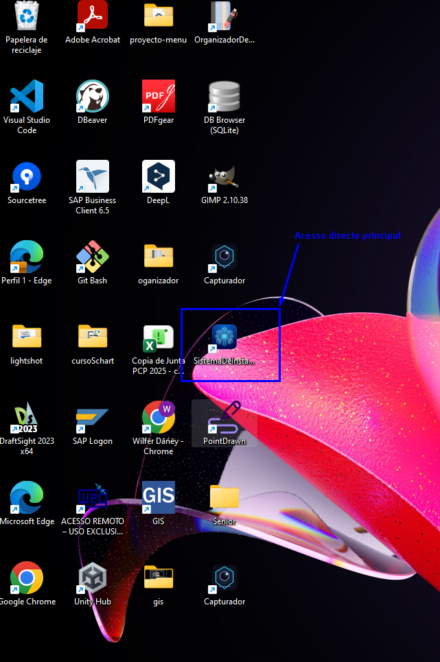


## Paso 2. Diferencia login normal y login admin

Esta es una de las reglas más importantes del sistema:

- el login normal es para operación estándar donde solo ingresan usuarios diferentes al rol admin o incluso el mismo admin, pero como usuario normal, solamente que tendría dos accesos de entrada;
- el login administrativo activa permisos que no tiene el de usuarios normales;
- un usuario con rol administrativo no obtiene acceso completo si entra por login normal;
- para ver la vista principal admin y las demás funciones de administración, siempre debe ingresar por la ruta admin.

## Paso 2.1. Acceso por login de usuario

Si el administrador entra por la ventana normal, el flujo de acceso, registro, recuperación e ingreso es el mismo de la guía de usuario.

Este provceso lo puedes ver en el siguiente enlace:

### Resultado del login normal para un administrador

Después de entrar por login normal:

- verá la misma vista general del usuario estándar;
- no verá módulos de gestión;
- no verá el módulo de logs;
- su experiencia será equivalente a la descrita en la guía `User`.

[Ver guía de usuario desde el acceso directo](help://users/user#paso-1-abrir-la-aplicacion)

## Ruta 2. Administrador operando por login administrativo

Esta es la ruta que debe usar el administrador cuando necesita hacer cambios funcionales dentro del sistema, y es ingresando por accesos que solo el administrador tiene como permisos, desde luego primero debera ingresar al login admin para continuar con los procesos de registro e ingresos.

## Paso 3. Registro administrativo

Si la cuenta administrativa aún no existe, primero debe registrarse desde la ruta admin en el texto que le indica registrarse. 

### Paso 3.1. Abrir la opción Regístrate del login admin

Desde la pantalla de login administrativo, pulsa la opción `Regístrate`.

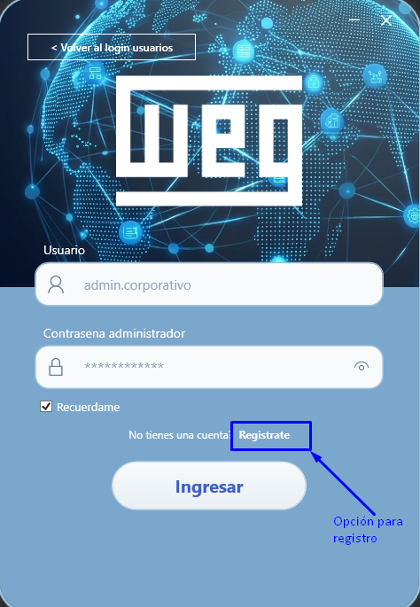

### Paso 3.2. Completar el formulario de registro administrativo

En el registro administrativo se deben completar:

- correo corporativo;
- rol administrativo;
- contraseña normal;
- contraseña administrativa.

Este registro no es igual al normal. Aquí el sistema crea o actualiza la cuenta base y además registra la información administrativa necesaria para operar en modo admin.

### Paso 3.3. Guardar el registro administrativo

Pulsa el botón de registro y espera la confirmación.

Si el proceso es correcto:

- se crea o actualiza el usuario base;
- se registra la cuenta administrativa;
- el sistema regresa al login admin con los datos listos para ingresar.

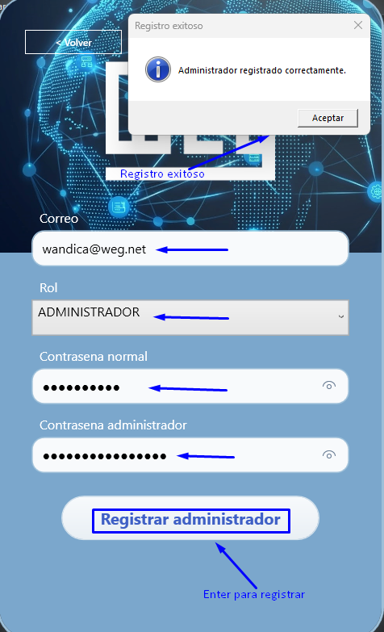

## Paso 4. Iniciar sesión por login administrativo

Una vez abierto el acceso directo y, si aplica, completado el registro, el siguiente paso es ingresar por el login admin.

### Paso 4.1. Abrir el login administrativo

Desde la pantalla principal, entra a la opción de acceso administrativo.

### Paso 4.2. Escribir el usuario administrativo

En este login debes usar el `UsuarioSistema` o identificador administrativo definido para la cuenta.

### Paso 4.3. Escribir la contraseña administrativa

Ingresa la contraseña administrativa correspondiente. Esta contraseña no se valida igual que la del login normal.

### Paso 4.4. Confirmar el ingreso

Pulsa el botón de acceso. Si todo es correcto, el sistema abrirá la vista principal con modo administrador activo.

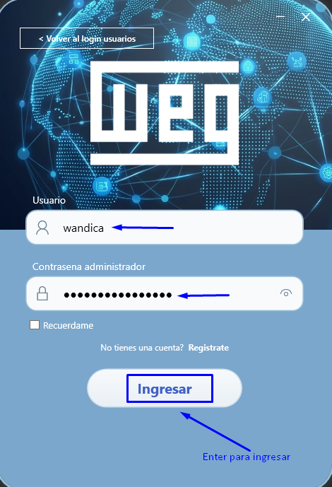

## Paso 5. Validaciones del login administrativo

El sistema diferencia mejor los errores del login admin.

### Cuando el usuario administrativo no existe

El sistema indicará que el usuario administrativo no se encuentra registrado.

### Cuando la contraseña administrativa es incorrecta

El sistema indicará que la contraseña administrativa es incorrecta.

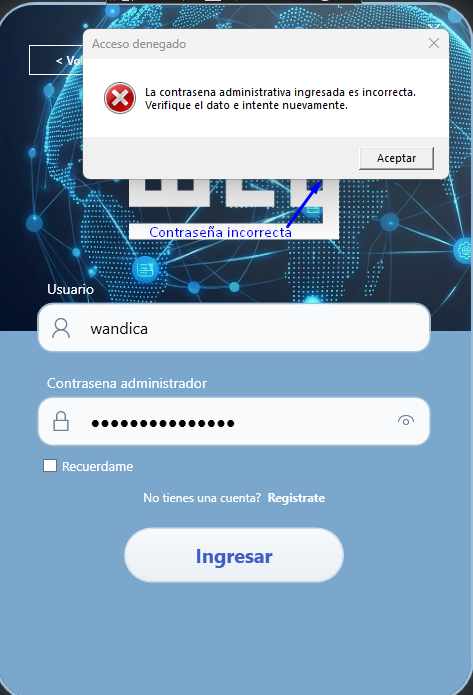

## Paso 6. Vista principal del administrador

Cuando el login admin es correcto, la aplicación entra en modo administrador.

Normalmente verá:

- panel lateral;
- módulo `Instaladores`;
- módulo `Gestión de Usuarios`;
- opción `Ayuda`;
- opción `Configuración` para revisar o cambiar el tema visual;
- opción `Logs` solo si el perfil cumple la validación especial de soporte;
- opción `Cerrar sesión`.

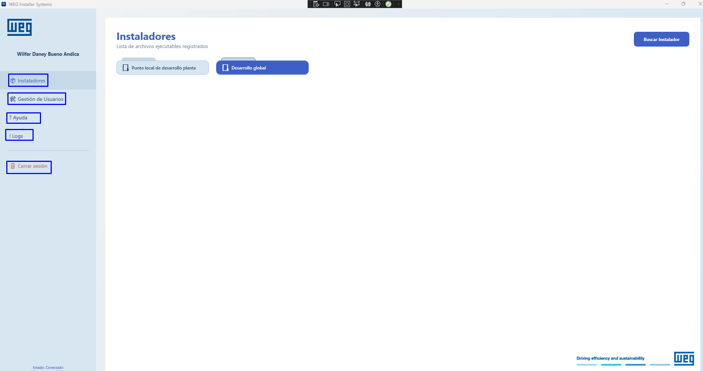

## Paso 7. Gestión de instaladores

Desde este módulo se controla el catálogo de ejecutables del sistema.

[Ver guía de usuario desde "Qué pasa cuando el login es correcto"](help://users/user#que-pasa-cuando-el-login-es-correcto)

### Cómo agregar un instalador

1. entra al módulo `Buscar Instaladores`;
2. abre el formulario de nuevo instalador;
3. selecciona el ejecutable;
4. completa nombre, descripción y categoría;
5. guarda el registro.

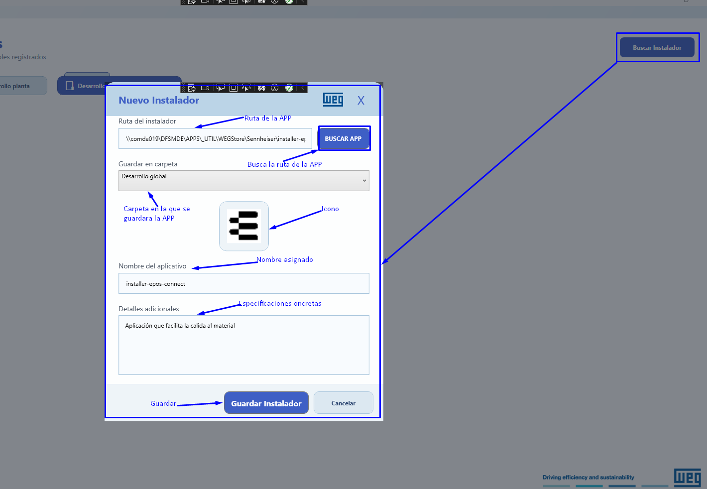

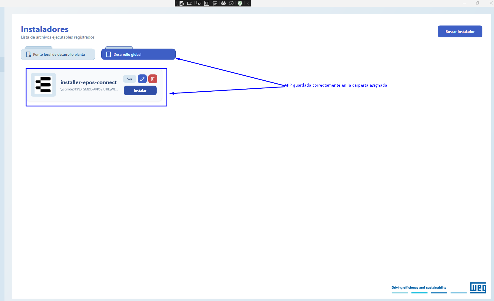


### Cómo editar o eliminar un instalador

Para editar:

1. ubica la tarjeta correcta;
2. pulsa el icono del lapiz que es `Editar`;
3. actualiza la información;
4. guarda nuevamente los cambios realizados.

Para eliminar:

1. ubica la tarjeta correcta nuevamente;
2. pulsa el icono de la papelera que es `Eliminar`;
3. confirma la acción y elimina el registro por completo.

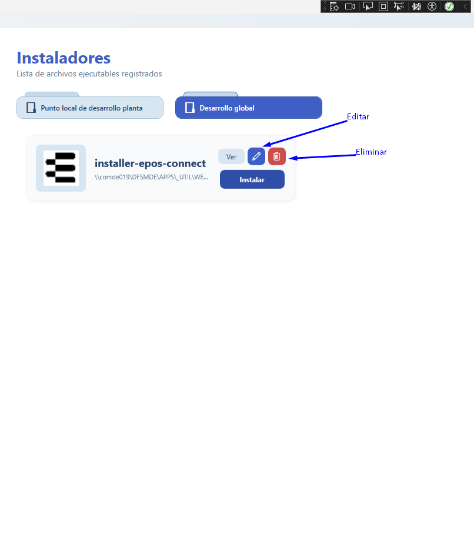


### Cómo instalar un aplicativo registrado

Cuando el instalador ya está registrado, el administrador también puede probar el proceso de instalación desde la tarjeta correspondiente.

1. ubica la tarjeta del aplicativo que deseas instalar;
2. pulsa el botón `Instalar`;
3. espera a que Windows abra la ventana de ejecución o instalación;
4. confirma la ejecución si Windows lo solicita;
5. continúa el asistente de instalación hasta finalizar;
6. valida que la aplicación se abra correctamente al terminar.

[Ver proceso de instalación en la guía de usuario](help://users/user#como-ejecutar-un-aplicativo-asignado)

## Paso 8. Gestión de usuarios

Este módulo solo está disponible en modo administrador. Desde aquí se administran cuentas y permisos.

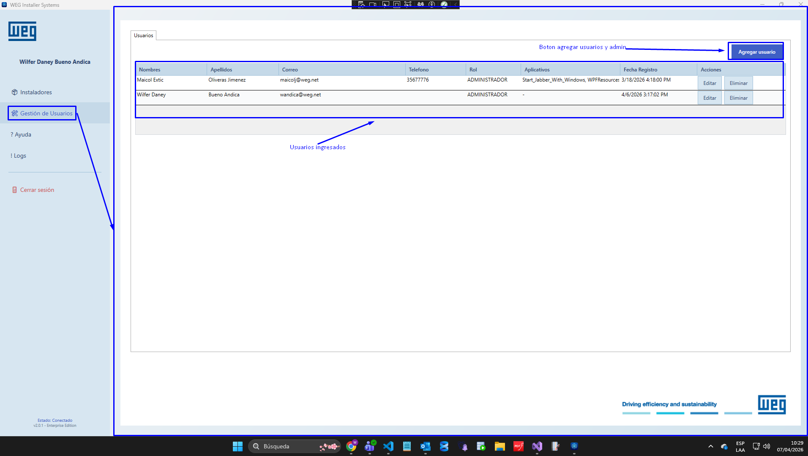

### Cómo agregar un usuario

1. abre `Gestión de Usuarios`;
2. pulsa la opción para agregar usuarios para agregar ;
3. completa nombres, apellidos, correo, teléfono, contraseña y rol;
4. guarda la información.

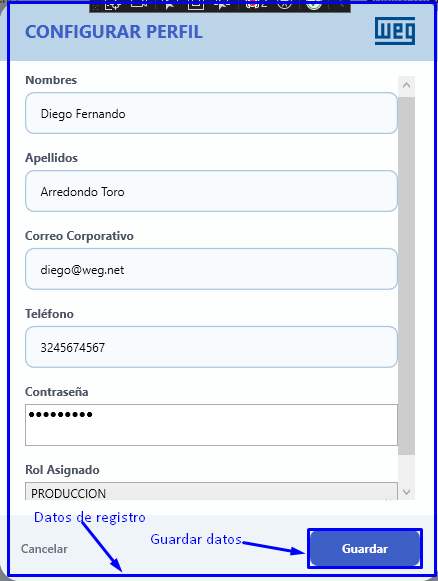

### Cómo editar o eliminar un usuario

Para editar:

1. localiza el registro;
2. pulsa `Editar`;
3. actualiza la información;
4. guarda.

Para eliminar:

1. localiza el registro;
2. pulsa `Eliminar`;
3. confirma la acción.

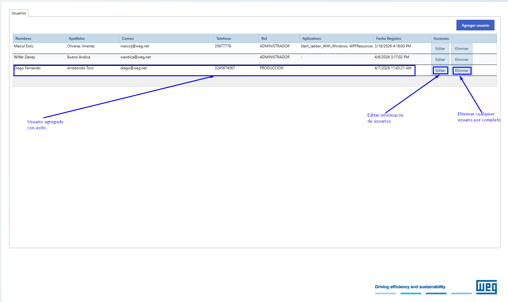

## Paso 9. Asignación de aplicativos

Dentro de `Gestión de Usuarios`, el administrador puede asignar o retirar aplicativos a una persona.

El flujo general es:

1. seleccionar el usuario;
2. abrir el panel de asignación;
3. marcar o desmarcar aplicativos;
4. guardar la asignación.

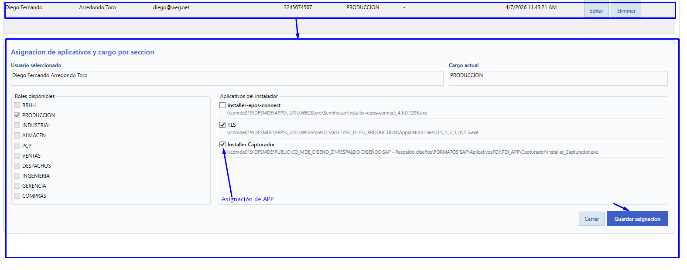


## Paso 10. Uso de la pestaña Ayuda

La pestaña `Ayuda` permite al administrador consultar documentación funcional dentro del sistema, sin tener que salir de la aplicación para buscar manuales o instrucciones.

Desde esta vista normalmente se puede:

- navegar entre carpetas de documentación;
- abrir guías administrativas y funcionales;
- revisar información complementaria;
- ubicar el canal de soporte disponible.

### Paso 10.1. Abrir la pestaña Ayuda

Desde el panel lateral, pulsa la opción `Ayuda`.

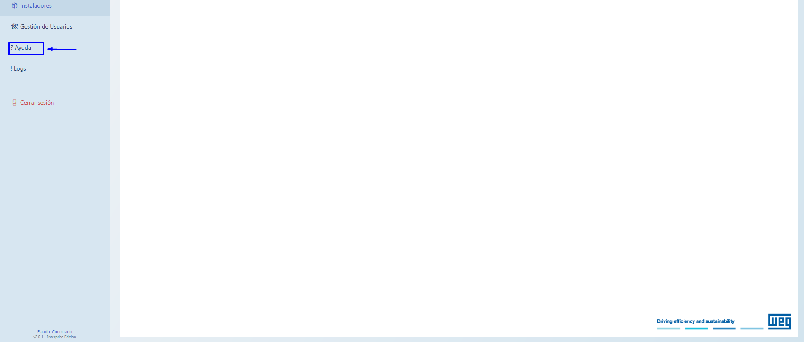

### Paso 10.2. Revisar las carpetas y documentos disponibles

En la vista de ayuda, el administrador verá las carpetas y documentos disponibles para su perfil.

### Paso 10.3. Abrir un documento y consultar su contenido

Selecciona el documento requerido y revisa la información en el panel principal.

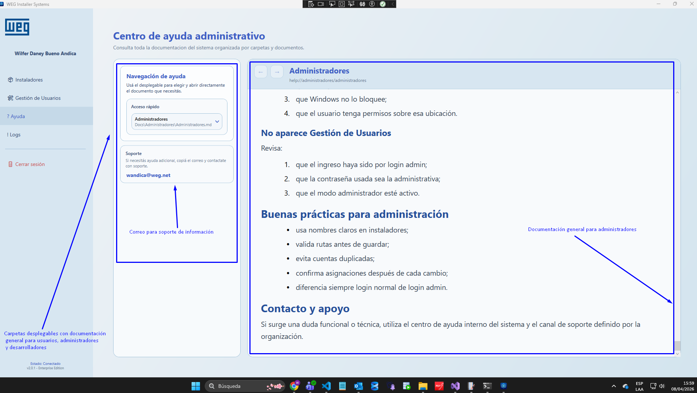

## Paso 11. Configuración

La pantalla `Configuración` permite al administrador ajustar preferencias visuales de la aplicación sin salir del sistema.

La referencia funcional canónica de esta pantalla se mantiene en [User, Configuración](help://users/user#configuracion), porque el recorrido y el cambio de tema son compartidos entre perfiles.

## Paso 12. Cerrar sesión

Cuando el administrador termine:

1. debe volver al panel lateral;
2. pulsar `Cerrar sesión`;
3. confirmar el cierre si aplica;
4. dejar el sistema en la pantalla inicial.

## Qué revisar después de un cambio importante

Después de agregar, editar, eliminar o asignar, valida:

- que el usuario aparezca correctamente;
- que el instalador siga visible en el catálogo;
- que el usuario pueda ingresar;
- que el catálogo filtrado coincida con la asignación realizada.

## Casos de soporte frecuentes

### El usuario no ve su aplicativo

Revisa:

1. que el instalador exista;
2. que el usuario tenga asignaciones;
3. que la ruta del ejecutable siga siendo válida.

### El ejecutable no abre

Revisa:

1. que el archivo exista en la ruta;
2. que no haya sido movido;
3. que Windows no lo bloquee;
4. que el usuario tenga permisos sobre esa ubicación.

### No aparece Gestión de Usuarios

Revisa:

1. que el ingreso haya sido por login admin;
2. que la contraseña usada sea la administrativa;
3. que el modo administrador esté activo.

## Buenas prácticas para administración

- usa nombres claros en instaladores;
- valida rutas antes de guardar;
- evita cuentas duplicadas;
- confirma asignaciones después de cada cambio;
- diferencia siempre login normal de login admin.

## Contacto y apoyo

Si surge una duda funcional o técnica, utiliza el centro de ayuda interno del sistema y el canal de soporte definido por la organización.
