# User

Este guia foi pensado para o usuário final do sistema. Seu objetivo é explicar, de forma clara e ordenada, como se registrar, entrar, recuperar acesso, revisar os instaladores atribuídos e executar os aplicativos disponíveis.

## Objetivo deste guia

Com este guia o usuário poderá:

- registrar-se corretamente no sistema;
- entrar com suas credenciais;
- recuperar acesso caso esqueça a senha;
- entender o que aparece na tela principal;
- abrir os aplicativos atribuídos à conta;
- identificar o que revisar quando algo não aparece ou falha.

## O que a aplicação faz para o usuário

A aplicação centraliza em uma única interface os instaladores e executáveis que cada usuário tem autorização para utilizar. Isso evita procurar atalhos em várias pastas, reduz erros operacionais e ajuda cada pessoa a ver apenas o que realmente pode usar.

## Antes de começar

Antes de entrar, confirme o seguinte:

- seu usuário ou e-mail já foi registrado no sistema;
- você possui uma senha ativa;
- o administrador já atribuiu os aplicativos que você precisa ver;
- você está entrando pelo login normal e não pelo acesso administrativo.

## Fluxo geral de uso

```text
Abrir a aplicação
        |
        +--> Registrar-se pela primeira vez
        |
        \--> Entrar
                |
                +--> Login correto -> catálogo de instaladores atribuídos
                |
                \--> Login incorreto -> mensagem específica de validação
```

### Passo 1. Abrir a aplicação

Abra o atalho do sistema na área de trabalho ou a localização definida pelo suporte. Ao iniciar, o sistema exibirá a tela de acesso para usuários.

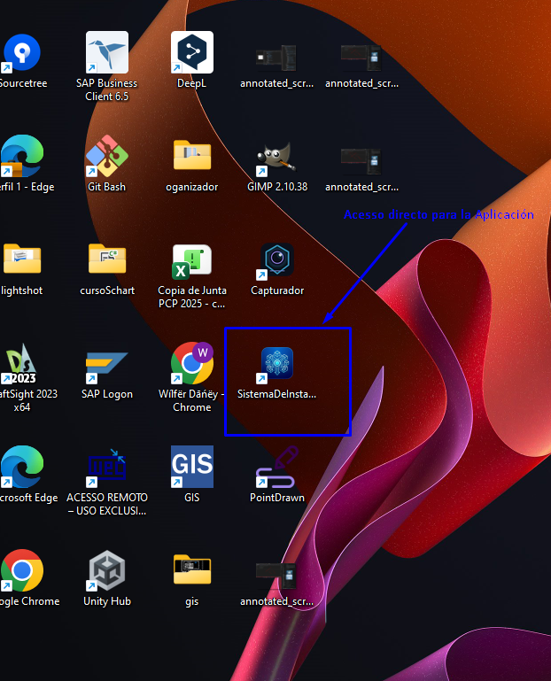

## Registro de usuário

O registro normal permite criar uma conta operacional para o uso diário do sistema.

### Passo 1. Abrir a opção de registro

Na tela de login normal, clique na opção `Registrar-se`.

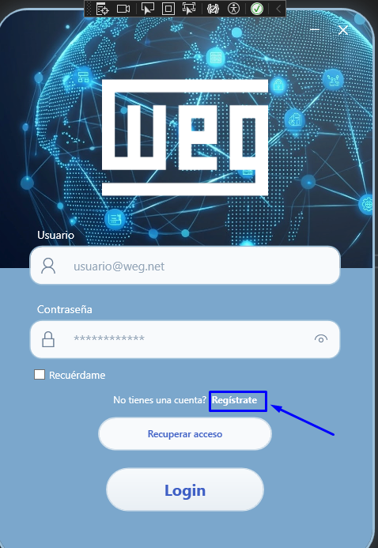

### Passo 2. Preencher os dados do registro

No formulário de registro você deve informar:

- e-mail corporativo;
- senha.

O sistema completará internamente as informações básicas de acordo com as regras atuais do projeto e validará que o e-mail pertença ao domínio permitido.

### Passo 3. Salvar o registro

Clique no botão de registro e aguarde a confirmação do sistema.

Se o e-mail já existir, o sistema informará isso. Se o registro for correto, ele retornará ao login com os dados prontos para entrar.

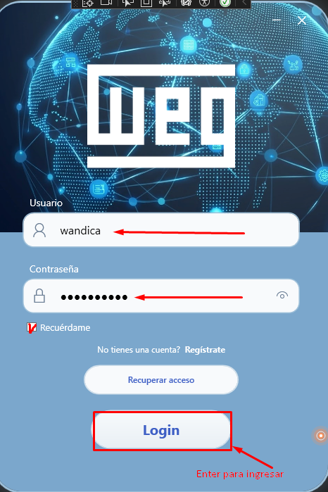

## Passo a passo para entrar

### Passo 2. Informar usuário ou e-mail

No campo de usuário você pode digitar:

- seu usuário registrado;
- ou seu e-mail corporativo registrado.

Você deve digitá-lo exatamente como foi criado no sistema para evitar erros de validação.

### Passo 3. Informar a senha

Digite sua senha no campo correspondente. Se cometer um erro de digitação, o sistema não permitirá o acesso.

Se o teclado estiver com Caps Lock ativado, revise isso antes de continuar.

### Passo 4. Usar a opção Lembrar de mim se necessário

Se quiser que o sistema lembre seus dados nesse computador, marque a opção `Lembrar de mim`.

Use essa opção somente quando o computador for pessoal ou de uso controlado. Não é recomendada em equipamentos compartilhados.

### Passo 5. Clicar em Entrar

Clique no botão `Entrar`. Se os dados estiverem corretos, o sistema abrirá a vista principal com os instaladores atribuídos à sua conta.

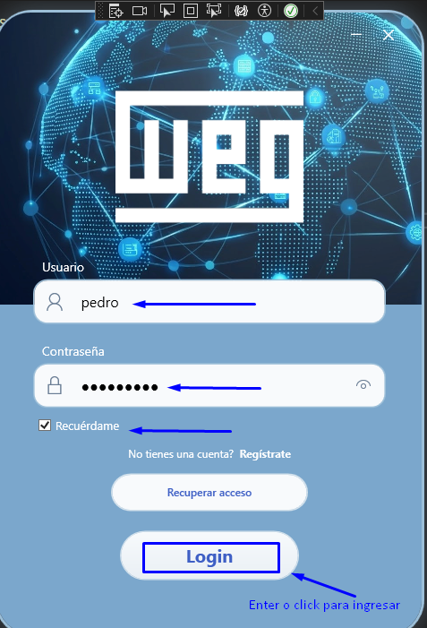

## O que acontece quando o login falha

Se o sistema não permitir seu acesso, pode estar acontecendo uma destas situações:

- o usuário ou e-mail não existe no banco de dados;
- a senha não coincide;
- você está digitando um e-mail diferente do registrado;
- a conta ainda não foi criada.

O sistema já diferencia quando o dado incorreto é o usuário ou e-mail e quando o dado incorreto é a senha.

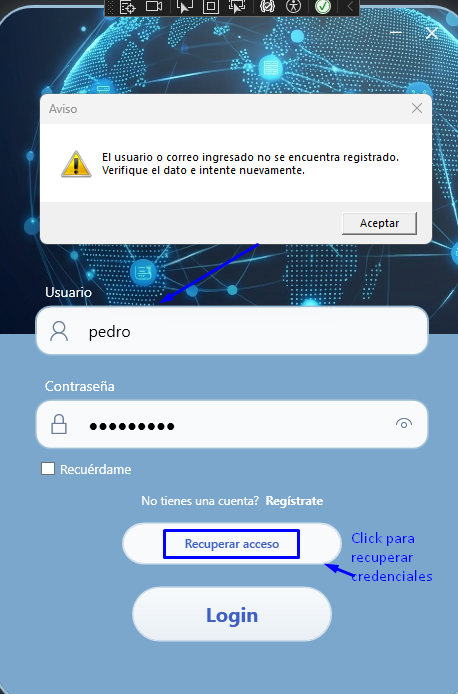

## Recuperação de senha

Se você esqueceu a senha, use a rota de recuperação incluída na tela de acesso.

### Passo 1. Abrir a opção de recuperação

Na tela de login, entre na opção de recuperação de acesso.

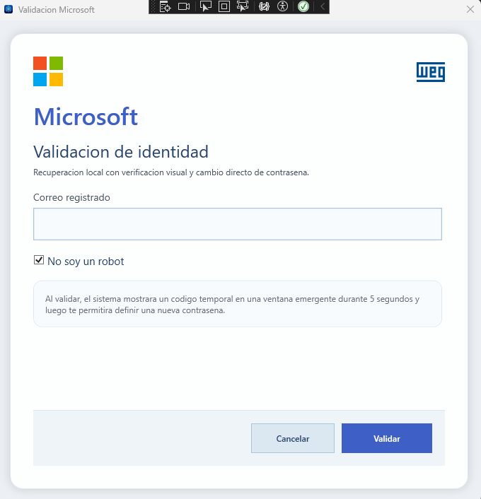

### Passo 2. Informar o e-mail registrado

Digite o e-mail corporativo com o qual sua conta foi criada. O sistema validará se esse e-mail existe.

### Passo 3. Validar o processo de recuperação

Siga as instruções mostradas na tela. O sistema pode exigir validações prévias antes de permitir a troca de senha.

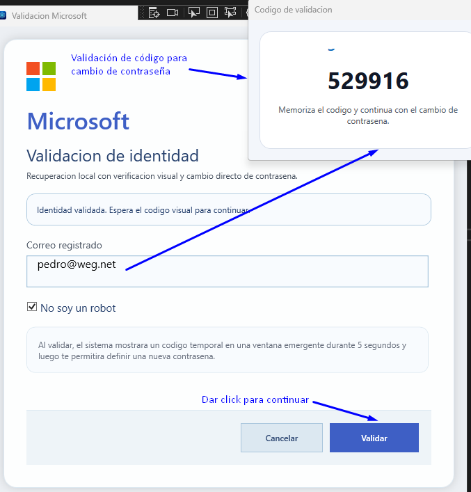

### Passo 4. Registrar a nova senha

Quando o sistema permitir, digite a nova senha e confirme a alteração.

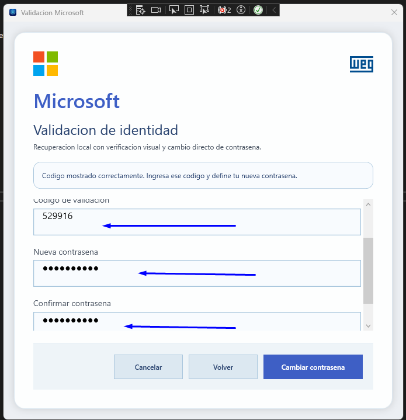

## O que acontece quando o login é correto

## Vista principal do usuário

Depois de entrar, o usuário acessa a vista de instaladores.

Nessa tela normalmente encontrará:

- painel lateral com seu nome;
- opção `Instaladores`;
- opção `Ajuda`;
- opção `Configuração` para ajustar o tema visual da aplicação;
- botão `Encerrar sessão`;
- cartões com os aplicativos atribuídos tanto na pasta local de desenvolvimento da planta quanto na pasta de desenvolvimento global.

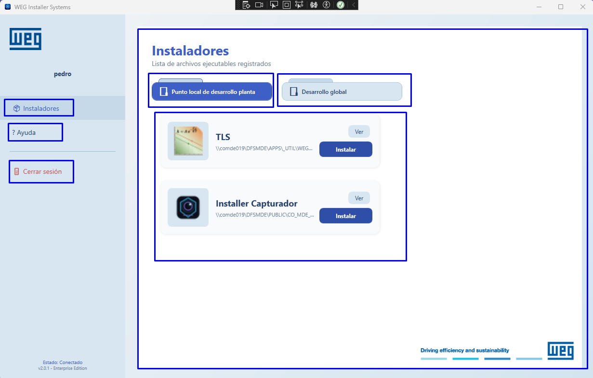

## Como ler um cartão de instalador

Cada cartão pode mostrar visualmente:

- nome do aplicativo;
- caminho ou referência do executável;
- ícone do programa;
- botão `Ver`;
- botão `Instalar` ou executar, de acordo com a configuração do sistema.

Isso permite identificar rapidamente qual aplicação está sendo usada e confirmar se ela corresponde ao seu processo.

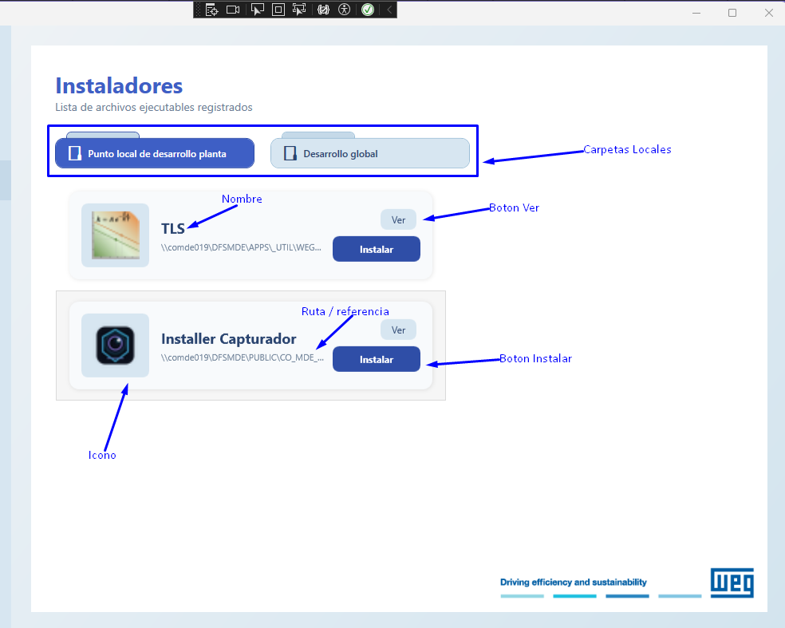

## Como revisar o detalhe de um aplicativo

Se quiser ampliar a informação antes de abri-lo:

1. localize o cartão do aplicativo;
2. clique em `Ver`;
3. revise o nome, a descrição e a informação visível do executável.

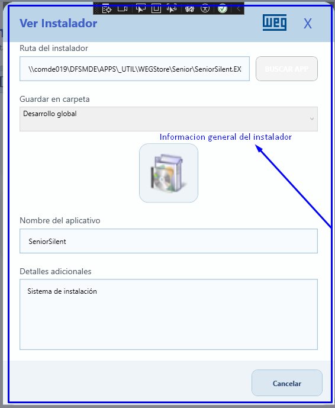

## Como executar um aplicativo atribuído

Para abrir um aplicativo:

1. localize o cartão correspondente;

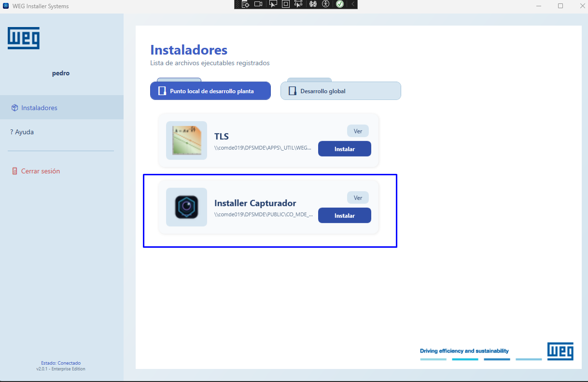

2. clique no botão `Instalar` disponível no cartão;

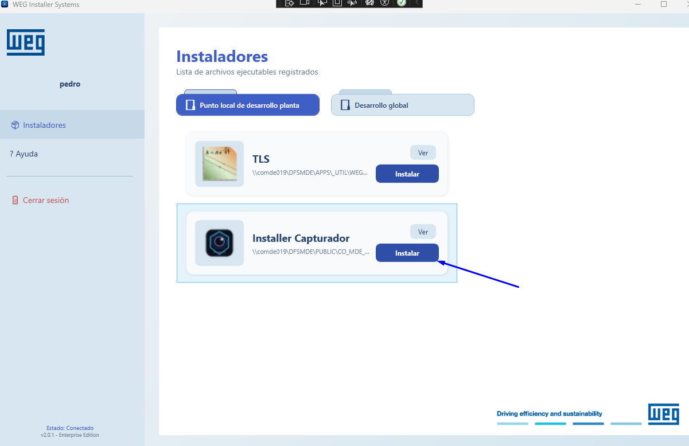

3. aguarde até que o Windows abra a confirmação de execução e clique em `Executar` para continuar;

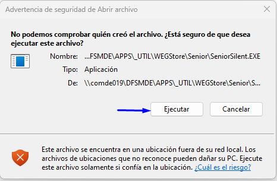

4. aguarde alguns minutos enquanto a janela de instalação ou atualização carrega; depois verifique se tudo está correto e continue clicando em `Instalar` ou `Atualizar`;

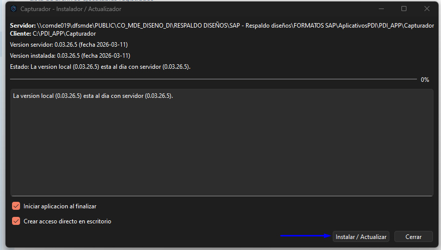

5. aguarde enquanto a instalação é concluída e, ao final, o sistema mostrará uma janela indicando que a instalação terminou com sucesso;

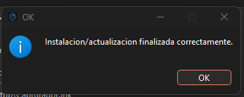

6. ao final, a aplicação será aberta automaticamente. Se o arquivo estiver corretamente registrado e o caminho existir, o sistema abrirá a aplicação sem passos adicionais.

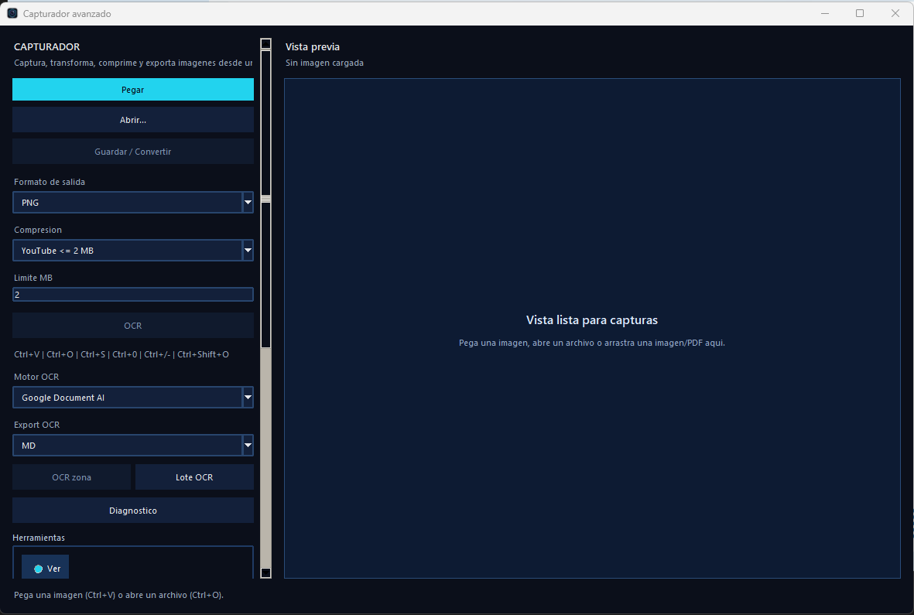

## Como usar a guia Ajuda

A guia `Ajuda` permite consultar a documentação interna do sistema sem sair da aplicação. Essa vista serve para revisar procedimentos, entender fluxos funcionais e localizar informações de suporte quando necessário.

Dentro da guia `Ajuda`, normalmente você poderá:

- revisar pastas de documentação;
- abrir guias funcionais;
- ler instruções passo a passo;
- localizar dados de suporte visíveis na tela.

### Passo 1. Abrir a guia Ajuda

No painel lateral, clique na opção `Ajuda`.

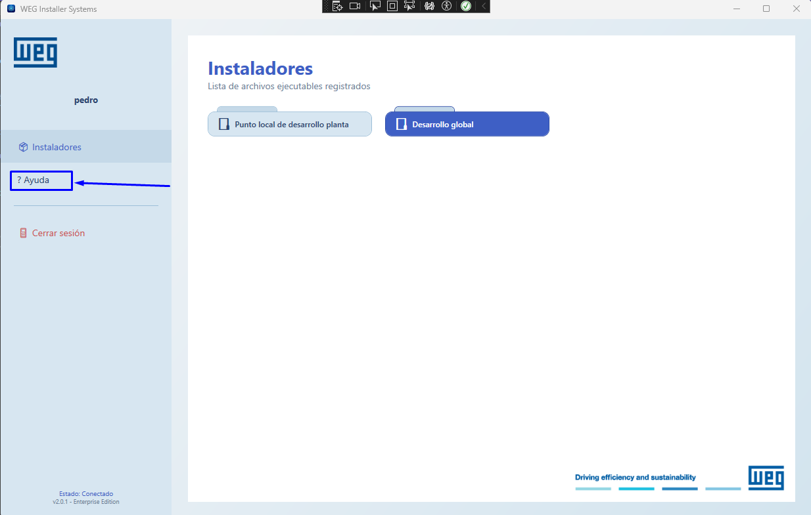

### Passo 2. Revisar as pastas e documentos disponíveis

No centro de ajuda serão exibidas as pastas e os documentos organizados para consulta.

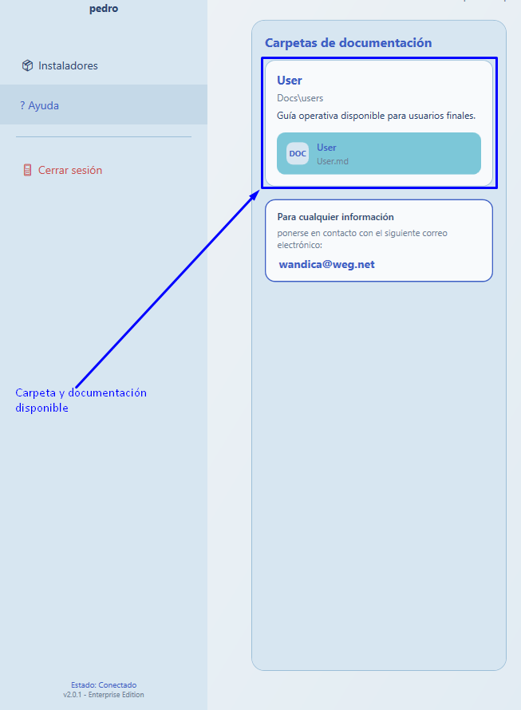

### Passo 3. Abrir e ler um documento

Selecione o documento necessário e revise seu conteúdo no painel principal.

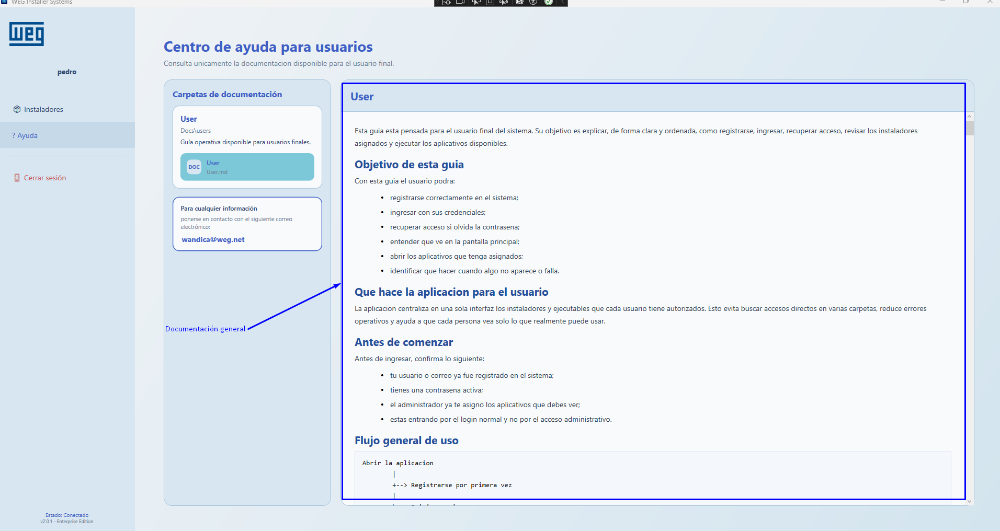

## Configuração

A opção `Configuração` permite ajustar as preferências visuais da aplicação, em especial o tema disponível para o ambiente de trabalho.

Nessa tela o usuário pode revisar o tema ativo e alterar a aparência quando precisar trabalhar com outro modo visual dentro da aplicação.

### Passo 1. Abrir Configuração

No painel lateral, clique na opção `Configuração`.

### Passo 2. Revisar o estado visual atual

Essa vista mostra o tema ativo da aplicação e como a interface está respondendo ao ambiente visual do equipamento.

A aplicação pode iniciar respeitando a preferência visual do computador. Em `Configuração`, o usuário pode manter esse comportamento ou alterar manualmente o tema disponível conforme a necessidade do momento.

### Passo 3. Alternar entre tema claro e escuro

Para trocar o tema:

1. abra `Configuração`;
2. localize a opção de aparência ou tema;
3. selecione `Claro` ou `Escuro`;
4. confirme a alteração se a interface solicitar.

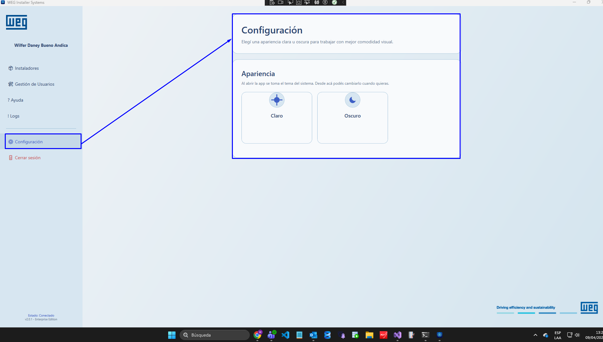

Quando a alteração é aplicada, a interface visual da aplicação é atualizada e a apresentação da documentação integrada também muda para manter uma experiência consistente.

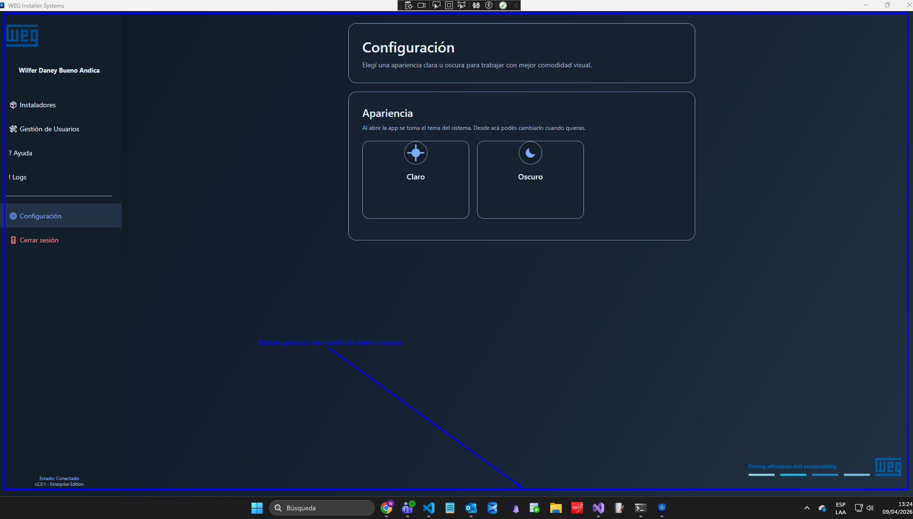

## Como encerrar a sessão

Quando terminar seu trabalho:

1. vá ao painel lateral;
2. clique em `Encerrar sessão`;
3. o sistema fechará sua sessão atual e retornará à tela de acesso.

Isso é especialmente importante se o equipamento for compartilhado.

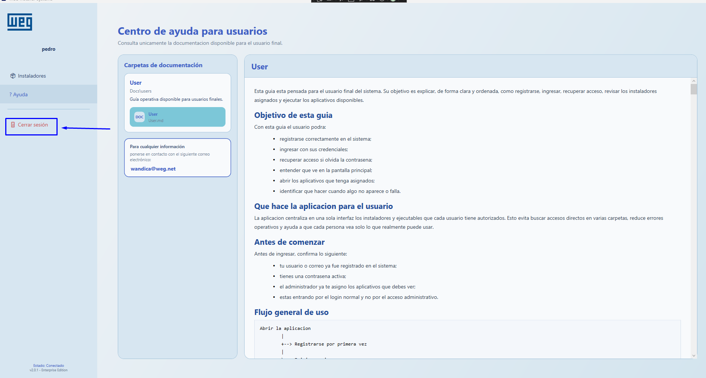

## O que um usuário final não pode fazer

Um usuário final não pode:

- registrar novos instaladores;
- editar instaladores;
- excluir instaladores;
- entrar em Gestão de Usuários;
- atribuir aplicativos a outras pessoas;
- abrir o módulo de logs;
- usar permissões administrativas a partir do login normal.

## Problemas comuns e o que revisar

### Não vejo meus instaladores

Revise o seguinte:

1. se sua conta está corretamente criada;
2. se o administrador atribuiu aplicativos para você;
3. se o executável ainda existe no caminho registrado.

### O sistema não permite meu acesso

Verifique:

1. se o usuário ou e-mail está bem escrito;
2. se a senha está correta;
3. se você não está usando uma conta ainda não registrada;
4. se não está tentando entrar por uma rota diferente.

### O aplicativo não abre

Isso pode acontecer por:

- caminho inexistente;
- arquivo movido ou excluído;
- permissões do Windows sobre o caminho;
- mudanças operacionais ainda não atualizadas pela administração.

## Recomendações de uso

- use sempre a conta corporativa correta;
- não compartilhe sua senha;
- encerre a sessão ao finalizar;
- informe ao suporte se um caminho registrado já não abrir;
- evite criar contas duplicadas quando o problema real for a senha.

## Contato

Se o problema não for resolvido com este guia, utilize o canal de suporte visível dentro do centro de ajuda do sistema.

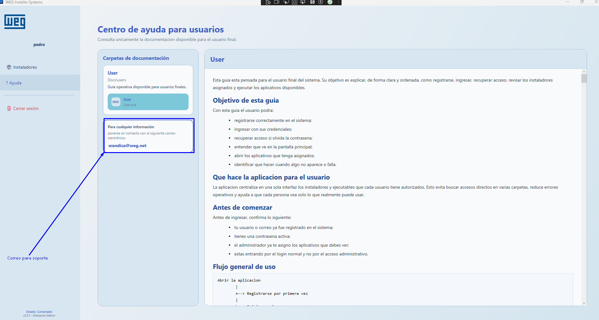
